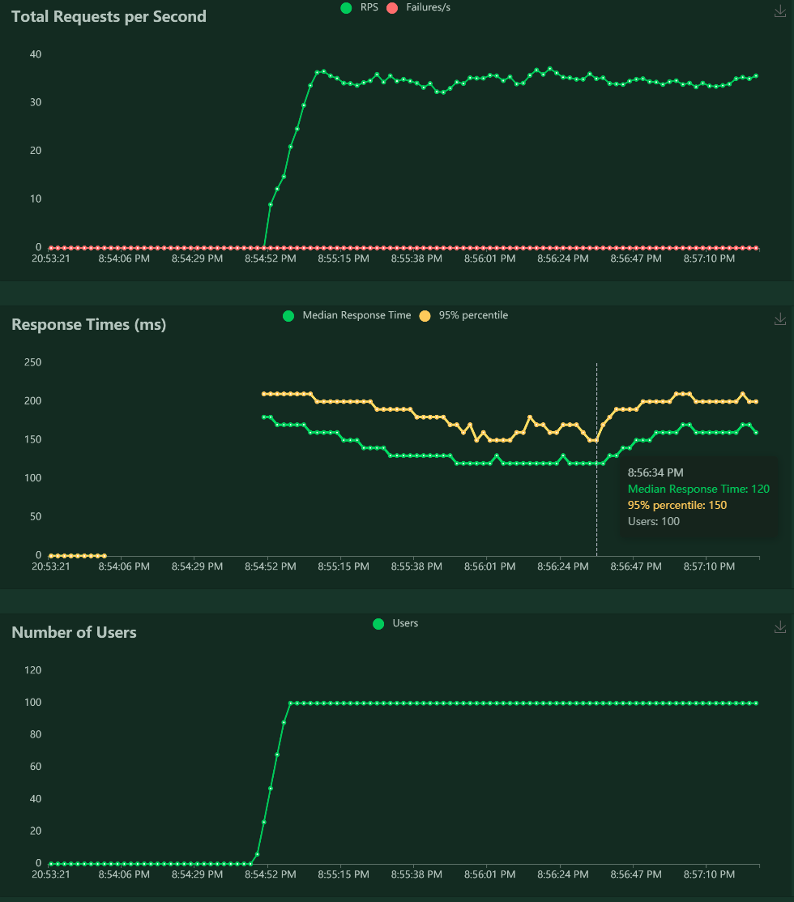
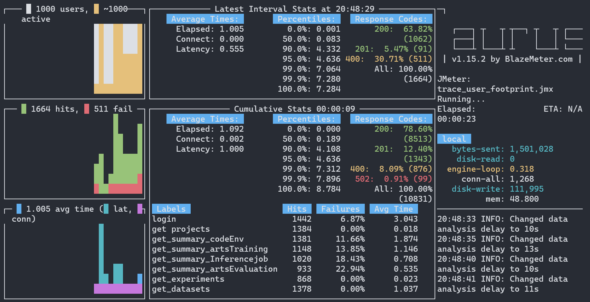

<p align="center">

</p>

-----------

[](LICENSE)
[](https://machinewolf.readthedocs.io/en/latest/?badge=latest)


[](https://gitter.im/banrieen/MachineWolfHome?utm_source=badge&utm_medium=badge&utm_campaign=pr-badge)
[](https://codecov.io/gh/banrieen/MachineWolf)
[](https://travis-ci.org/banrieen/MachineWolf)


<!--  -->
<!-- [](https://github.com/apulis/MachineWolf/actions)
[](https://github.com/apulis/MachineWolf/actions) -->


[MachineWolf Doc](README_en_US.md) | [简体中文](https://machinewolf.readthedocs.io/en/latest/)

**MachineWolf** 是一个自动化测试性能套件，促进 AiOps 实施。


### 快速使用指导

* 在本地执行测试脚本

    ```bash
    sudo chmod +x init_dev.sh
    bash ./init_dev.sh
    locust -f ./example/locust/test_http.py --conf ./example/locust/host.conf
    ```

* 在docker环境中执行testsuites

    1. 拉取已经编译好的镜像
    
    `docker pull banrieen/machinewolf`

    2. 执行docker
    
    ```bash
    docker run -d     -p 8088:8080  -p 8090:8090     --name "ml-workspace"  -v "${PWD}:/workspace"  --env NOTEBOOK_ARGS="--NotebookApp.notebook_dir=/home"  --shm-size 2048m  --restart always     banrieen/machinewolf:latest
    # 打开jupyterlab
    # http://<xxx.xxx.xxx.xxx>:8088 
    ```

* 使用taurus执行locust脚本

    `bzt example/taurus/quick_test.yml`

* 使用taurus执行jmeter脚本

    `bzt example/jmeter/trace_user_footprint.jmx`

* 使用taurus执行纯yaml脚本

    `bzt example/taurus/quick_test.yml`

* 使用pytest执行非接口类的脚本，比如ha,吞吐量测试集等

    `pytest example/pytest/test_ha.py`

**测试报告示例**



**CLI看板示例**



**导出测试报告**

* `testreport/result.csv_stats.csv`
* `testreport/result.csv_stats_history.csv`
* `testreport/result.csv_failures.csv`
* `testreport/result.csv_exceptions.csv`

### 分支说明


| 分支名称     |说明|
| ----------- | -------------------------------------------------------------------- |
| Master      | 主分支，维护发布产品的最新发布代码，从Release 或 Feature 合并为正式发布的历史|
| Feature     | 开自Master分支，主要用于开发新功能的或专项的测试集，根据负责模块自行维护；命名规范为：feature/#...，每一个功能都应对应一个issue，...即为issue号. |
| Hotfix      |	开自Master分支，主要用于修复当前已发布版本的已知bug；解决bug时注意事项参考Bugfix。命名规范为：hotfix/#... |
| Release	  | 开自Master分支，主要用于发布版本，一旦Master分支上有了做一次发布（或者说快到了既定的发布日）的足够功能，就从Master分支上fork一个发布分支。新建的分支用于开始发布循环，这个分支只应该做Bug修复、文档生成和其它面向发布任务。一旦对外发布的工作都完成了，执行以下三个操作：合并Release分支到Master； 给Master打上对应版本的标签tag； Release回归，这些从新建发布分支以来的做的修改要合并回Master分支。 命名规范为：release/...，...为版本号|
| ngihtly     | 每晚构建，对测试套件的示例和公共库执行验证，以保证相关脚本是可用的。|

> [!IMPORTANT]
> Master tag 为测试代码库自身的版本号
> Releas tag 同步与待测试产品的release/-x-tag;如被测产品为2.0.0-rc1，则可以拉取出来一个release/2.0.0-rc1
> Hotfix tag 也同被测产品的hostfix一样，测试时可以拉取出来一个hotfix/#窗口卡顿
> Feature tag 独立开发、调研的feature原型验证可以拉取一个如feature/#需求或bug

* 系统测试、迭代测试可直接拉取Master分支最新代码（tag）
* 所有经过调试，完成验证的 Feature、Hotfix、Release 都要合并到 Master


### 测试套件说明

* aisetshub:    模型验证相关
* datasetshub:  数据集验证相关
* testhub:      平台、组件测试案例和脚本
* issuesboard:  同步issues和report

### 测试集结构

测试套件本着兼容并蓄，容纳萃取的宗旨，独立灵活的组织测试套件。支持各种前沿的、优秀的工具和理念；目前将测试方案（testscheme）、数据(datas.yaml)、脚本(.py,.jmx)、执行计划（host.yml,taurus.yml）灵活的组织在一起。
目前还是一些样例，还需要完善和补充。

``` direction
|-- testhub/
    `-- testscheme
        |-- 5g_manufacturing
        |-- annotations_cvat
    `-- testsuites
        |-- annotations_cvat
            |-- host.conf
            |-- test_cvat_suites.py
            |-- datas.yaml
        |-- dlws
        |-- e2e_aiarts
        |-- ha_aiarts
        |-- jobmanager
        |-- songshanhu
    `-- testlib
        |-- fake_users
        |-- postgres_client
        |-- csv_client
```

### 安全性

为避免信息暴漏，无效信息泛滥。

* 所有测试脚本，说明文本和配置文件中去除一切ID, ACCOUNT, HOST信息
* 不保留任何测试环境信息，和任何测试数据
* 使用规范的标识替换敏感信息：

    + 账号： `<HOSTNAME>:<PASSWORLD>`
    + 主机： `<HOST>:<PORT>`
    + 链接： `<LINKTYPE>:<LINKADDRESS>`
    + 证书： `<KEYGEN> 或 <TOKEN>`
    + 邮件： `<EMAIL-NAME@EMAIL-SERVICE.COM>`

### 文档 

有关安装指南、教程和API的更多详细信息，请参阅[文档库](docs/zh_CN)

### 版本发布

* **Latest**

    1. 完整的套件架构
    2. 安装和环境准备
    3. 执行示例
    4. 基础测试用例集

* **规划**

    1. 补充和完善测试脚本
    2. 调通禅道与测试套件的同步过程调通禅道与测试套件的同步过程
    3. 调通argo与测试套件的同步过程
    4. 补充框架、模型性能工具和脚本 
    5. 融合k8s中监控

**版本说明详情请参阅[RELEASE](./RELEASE.md)。**

### 版权协议

[MIT](LICENSE)

### 社区和联系

欢迎大家把问题、建议提到 github issues
* [Gitter讨论组](https://gitter.im/banrieen/MachineWolfHome?utm_source=share-link&utm_medium=link&utm_campaign=share-link)
* [#Machinewolf tag on StackOverflow](https://stackoverflow.com/search?q=%23Machinewolf)
* Twitter @MachinWolf
* QQ群 868444294 
